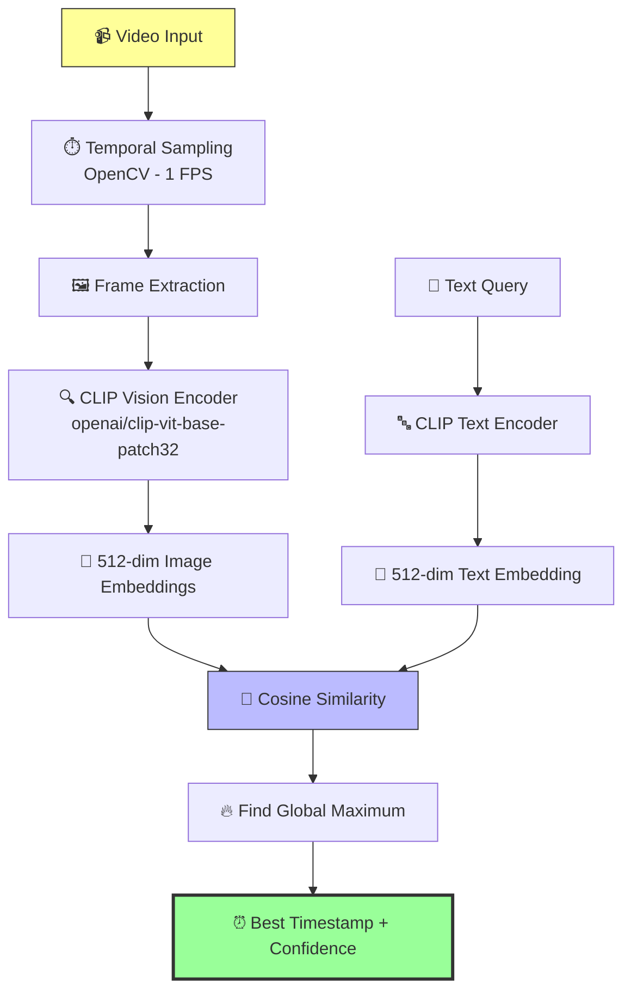

# Multimodal Video Insight Search

**Technical Documentation**

---

## Project Overview

This project implements a **high-performance Multimodal Video Search Engine** that allows users to query video content using natural language. The system identifies specific moments within a video file by computing semantic similarity between a text query and temporal visual samples (extracted frames).

**Key Capability**: Search inside videos with natural language — find the exact moment that best matches your description.

---

## 🏗️ System Architecture

🛠️ Technical Specifications
Core Technologies

Model: OpenAI CLIP ViT-B/32 (Vision Transformer)
Backend: PyTorch + Hugging Face Transformers
Video Processing: OpenCV + PIL
UI/UX: Gradio
Embedding Dimension: 512
Precision: float16 (optimized memory usage)

The Moondream2 Pivot
Initially, the project explored Moondream2 (a lightweight Vision-Language Model). However, due to repeated compatibility issues with the Transformers library (especially rope_scaling and pad_token_id errors in custom modeling files), the architecture was pivoted to CLIP.
Advantages of Switching to CLIP

AspectMoondream2CLIP (Chosen)WinnerStabilityFrequent config conflictsNative Transformers supportCLIPSpeedAutoregressive inferencePure embedding + similarityCLIPMemory UsageHigherVery efficient (float16)CLIPRetrieval TaskGoodExcellent (designed for it)CLIP

🧪 Inference Pipeline
mermaidCopyflowchart LR
    subgraph Preprocessing
        A[Video File] --> B[Decode with OpenCV]
        B --> C[Sample Frames @ 1Hz]
        C --> D[Resize 224×224]
        D --> E[Normalize\nImageNet Stats]
    end

    subgraph Encoding
        E --> F[CLIP Vision Encoder]
        G[Text Query] --> H[CLIP Text Encoder]
        F --> I[Image Embeddings\n512-dim]
        H --> J[Text Embedding\n512-dim]
    end

    subgraph Matching
        I & J --> K[Cosine Similarity]
        K --> L[Softmax over Time]
        L --> M[Max Score + Timestamp]
    end

    classDef proc fill:#e1f5fe,stroke:#01579b
    classDef enc fill:#f3e5f5,stroke:#4a148c
    classDef match fill:#e8f5e9,stroke:#1b5e20

    class Preprocessing proc
    class Encoding enc
    class Matching match

    
Mathematical Logic:
$$\text{Score}[i] = \text{CosineSimilarity}\big(\text{Embedding}(Q), \text{Embedding}(F[i])\big)$$
$$\text{Best Match} = \arg\max_i \text{Score}[i]$$
Confidence is obtained by applying Softmax across all frame scores.

🚀 Deployment
The system is deployed using Gradio, providing:

Drag & drop video upload
Natural language search box
Real-time visualization of similarity scores over time
Timestamped result with confidence percentage
Local tunnel support for easy sharing

Future Enhancements

Multi-query support
Temporal segment retrieval (not just single frame)
Integration with faster embedding models (e.g. SigLIP, CLIP-B/16)
Video indexing for large archives
Audio + Visual multimodal fusion
